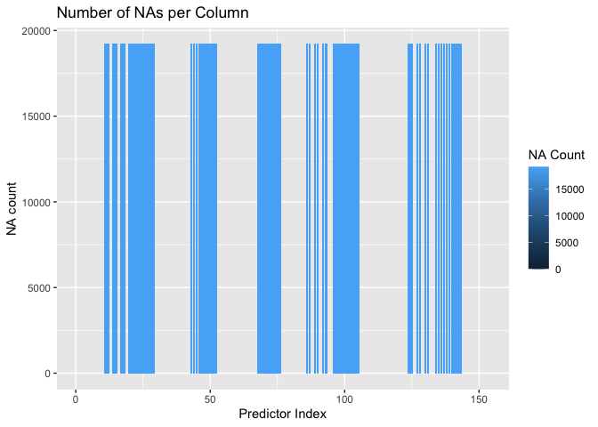
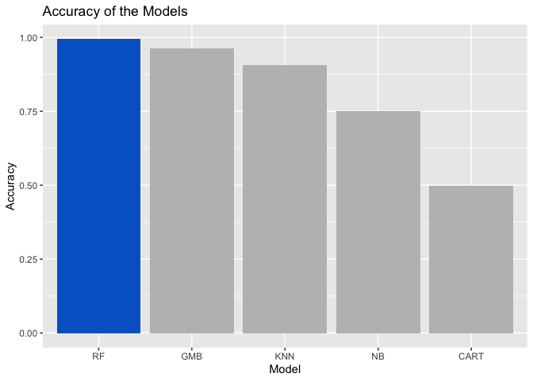
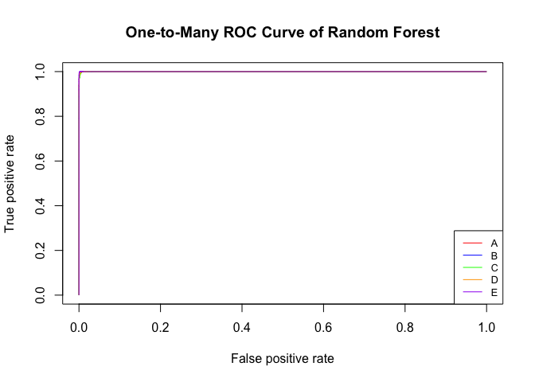

------------------------------------------------------------------------

## Introduction

Using devices such as *Jawbone Up*, *Nike FuelBand*, and *Fitbit* it is
now possible to collect a large amount of data about personal activity
relatively inexpensively. These type of devices are part of the
quantified self movement – a group of enthusiasts who take measurements
about themselves regularly to improve their health, to find patterns in
their behavior, or because they are tech geeks. One thing that people
regularly do is quantify how *much* of a particular activity they do,
but they rarely quantify *how well they do it*. In this project, your
goal will be to use data from accelerometers on the belt, forearm, arm,
and dumbell of 6 participants. They were asked to perform barbell lifts
correctly and incorrectly in 5 different ways.

------------------------------------------------------------------------

## Importing Libraries and Dataset

``` r
library(ggplot2)
library(caret)
library("ROCR")
```

Let us first import the libraries that will be used for this machine
learning project to ensure its reproducibility.

``` r
train <- read.csv("pml-training.csv") 
test <- read.csv("pml-testing.csv")   # For Answering the Questions
```

Now, let us import the dataset that will be used for this machine
learning project. The train dataset was imported and it will be used to
train and validate the model that will be used. After training and
choosing the appropriate model, we will predict the test dataset
consisting of 20 observations and classify them according to their
respective classes categorized into five (A, B, C, D, and E).

------------------------------------------------------------------------

## Data Preprocessing

``` r
train <- train[,8:160]; dim(train)
```

    ## [1] 19622   153

The first 7 column of the dataset contains the index, username,
timestamps, and windowing segment. These fields are not necessary in
training the models so they will be omitted from the dataset leaving us
with only **153** fields including the classe field.

``` r
column_na <- data.frame(ind = 1:ncol(train),na_count = sapply(train, function(x) sum(is.na(x))))
ggplot(data = column_na, aes(x = ind, y = na_count, fill = na_count))+
  geom_bar(stat= 'identity') + 
  xlab('Predictor Index') + 
  ylab('NA count')+
  labs(fill = 'NA Count', title = 'Number of NAs per Column')
```



``` r
train <- train[,column_na$na_count < max(column_na$na_count)]; dim(train)
```

    ## [1] 19622    86

Some of the fields have NA values. The figure shows the number of NA
values per fields and it is shown that some fields have **19216** NA
values while the remaining ones does not have any NA values. Since these
columns contains **0.9793089%** NA values, we will omit these fields
leaving us with only **86** remaining fields.

``` r
train <- train[,-nzv(train[,-ncol(train)])]; dim(train)
```

    ## [1] 19622    53

Next, we have to identify the fields that had a *near zero variance*
using the `nzv()` function. From here, we can eliminate more fields that
won’t contribute as much to the training and classification of the
dataset since they have zero variance. Upon omitting these fields, we
are finally have only **53** number of fields including the target
field.

``` r
index_train <- createDataPartition(y=train$classe, p=0.7, list=FALSE)
validation <- train[-index_train,]
train <- train[index_train,]; dim(train)
```

    ## [1] 13737    53

Now, we will partition the dataset to have a training dataset and a
validation dataset to assess the performance metrics of the models that
will be used. For this partitioning, we will use a hold-out method of
**70-30 division** of the train dataset where the 70% will be used for
training while the 30% will be used for validation. From here we can see
that the number of rows for the train dataset were reduced to 70%.

------------------------------------------------------------------------

## Model Training

``` r
kfold <- trainControl(method='cv', number = 5)
```

To ensure that we prevent over fitting, we will employ a **5-Fold Cross
Validation** to have a more generalized performance metrics. **Five (5)
number of folds** were used since the number of rows falls between 100
\< m \< 1,000,000 and the computing power is considered as well.

``` r
CARTmodel <- train(classe ~ ., data=train, trControl=kfold, method='rpart')
CARTmodel_predict <- predict(CARTmodel, newdata=validation)
CARTmodel_cm <- confusionMatrix(CARTmodel_predict, as.factor(validation$classe))

NBmodel <- train(classe ~ ., data=train, trControl=kfold, method='naive_bayes')
NBmodel_predict <- predict(NBmodel, newdata=validation)
NBmodel_cm <- confusionMatrix(NBmodel_predict, as.factor(validation$classe))

KNNmodel <- train(classe ~ ., data=train, trControl=kfold, method='knn')
KNNmodel_predict <- predict(KNNmodel, newdata=validation)
KNNmodel_cm <- confusionMatrix(KNNmodel_predict, as.factor(validation$classe))

GBMmodel <- train(classe ~ ., data=train, trControl=kfold, method='gbm')
GBMmodel_predict <- predict(GBMmodel, newdata=validation)
GBMmodel_cm <- confusionMatrix(GBMmodel_predict, as.factor(validation$class))

RFmodel <- train(classe ~ ., data=train, trControl=kfold, method='rf')
RFmodel_predict <- predict(RFmodel, newdata=validation)
RFmodel_cm <- confusionMatrix(RFmodel_predict, as.factor(validation$classe))
```

For this project, we will use various machine learning models
particularly Decision Trees using CART, Naive Bayes Model, K-Nearest
Neighbor Model, Gradient Boosting Machines, and the Random Forest
Ensemble.

``` r
model_name <- c('CART', 'NB', 'KNN', 'GMB', 'RF')
model_accuracy <- c(CARTmodel_cm$overall[1],
                    NBmodel_cm$overall[1],
                    KNNmodel_cm$overall[1],
                    GBMmodel_cm$overall[1],
                    RFmodel_cm$overall[1])
model_highlight <- ifelse(model_name == 'RF', 'yes', 'no')
acc_chart <- data.frame(model_name, model_accuracy, model_highlight)
ggplot(data = acc_chart, aes(x = reorder(model_name,-model_accuracy), 
                             y = model_accuracy, 
                             fill = model_highlight)) +
  geom_bar(stat= 'identity') + 
  xlab('Model') + 
  ylab('Accuracy')+
  labs(title = 'Accuracy of the Models') + 
  scale_fill_manual( values = c("yes"="#0066CC", "no"="gray"), guide = FALSE)
```


Upon training the different models, we have acquired its accuracy and it
shown in the figure above and listed below:

Accuracy:

-   **RF Model - 0.9937128**
-   GBM Model - 0.9615973
-   KNN Model - 0.9050127
-   NB Model - 0.7512319
-   CART Model - 0.4975361

Based from the results, it can be observed that the best classifier that
was trained would be the Random Forest Model outclassing all the other
model with an accuracy of **99.3712829%**.

``` r
model <- RFmodel
```

Because of this, we will set the Random Forest Model as the Model that
we will further look into in terms of performance.

------------------------------------------------------------------------

## Model Performance

``` r
RFmodel_cm
```

    ## Confusion Matrix and Statistics
    ## 
    ##           Reference
    ## Prediction    A    B    C    D    E
    ##          A 1673    5    0    0    0
    ##          B    1 1133    5    1    0
    ##          C    0    1 1019   13    2
    ##          D    0    0    2  948    5
    ##          E    0    0    0    2 1075
    ## 
    ## Overall Statistics
    ##                                           
    ##                Accuracy : 0.9937          
    ##                  95% CI : (0.9913, 0.9956)
    ##     No Information Rate : 0.2845          
    ##     P-Value [Acc > NIR] : < 2.2e-16       
    ##                                           
    ##                   Kappa : 0.992           
    ##                                           
    ##  Mcnemar's Test P-Value : NA              
    ## 
    ## Statistics by Class:
    ## 
    ##                      Class: A Class: B Class: C Class: D Class: E
    ## Sensitivity            0.9994   0.9947   0.9932   0.9834   0.9935
    ## Specificity            0.9988   0.9985   0.9967   0.9986   0.9996
    ## Pos Pred Value         0.9970   0.9939   0.9845   0.9927   0.9981
    ## Neg Pred Value         0.9998   0.9987   0.9986   0.9968   0.9985
    ## Prevalence             0.2845   0.1935   0.1743   0.1638   0.1839
    ## Detection Rate         0.2843   0.1925   0.1732   0.1611   0.1827
    ## Detection Prevalence   0.2851   0.1937   0.1759   0.1623   0.1830
    ## Balanced Accuracy      0.9991   0.9966   0.9949   0.9910   0.9966

Based on all the metrics and the confusion matrix, we can see that the
model has a satisfactory performance in classifying the classe target
variable into five (5) categories.

``` r
labelA = ifelse(validation$classe == "A", 1, 0)
labelB = ifelse(validation$classe == "B", 1, 0)
labelC = ifelse(validation$classe == "C", 1, 0)
labelD = ifelse(validation$classe == "D", 1, 0)
labelE = ifelse(validation$classe == "E", 1, 0)
predictions = cbind(predict(model,
                            newdata = validation,
                            type = c("prob"))[,c("A")],
                    predict(model,
                            newdata = validation,
                            type = c("prob"))[,c("B")],
                    predict(model,
                            newdata = validation,
                            type = c("prob"))[,c("C")],
                    predict(model,
                            newdata = validation,
                            type = c("prob"))[,c("D")],
                    predict(model,
                            newdata = validation,
                            type = c("prob"))[,c("E")]
                    )
labels = cbind(labelA,labelB,labelC,labelD,labelE)
pred2 <- prediction(predictions, labels)
perf2 <- performance(pred2, 'tpr', 'fpr')
plot(perf2, col=list('red','blue', "green", "orange", "purple"))
legend("bottomright", legend = c("A", "B", "C", "D", "E"),
       col = c("red", "blue", "green", "orange", "purple"), lty = 1:1, cex = 0.8)
title("One-to-Many ROC Curve of Random Forest")
```



For further analysis, we look into the ROC curve of the Random Forest
Model. We employed a one-to-all technique for plotting the ROC since we
are dealing with a multi-class model. Based on the ROC Curve, all of the
classes are almost near to the upper-left corner of the plot signifying
that the true positive rate is high across the board. This is another
good measure that the model that we have chosen has satisfactory
performance.

------------------------------------------------------------------------

## Significant Features

``` r
varImp(model)
```

    ## rf variable importance
    ## 
    ##   only 20 most important variables shown (out of 52)
    ## 
    ##                      Overall
    ## roll_belt             100.00
    ## pitch_forearm          61.19
    ## yaw_belt               55.01
    ## magnet_dumbbell_y      44.56
    ## pitch_belt             44.33
    ## magnet_dumbbell_z      43.12
    ## roll_forearm           41.41
    ## accel_dumbbell_y       21.63
    ## accel_forearm_x        17.15
    ## roll_dumbbell          16.57
    ## accel_belt_z           15.19
    ## magnet_dumbbell_x      15.16
    ## magnet_belt_z          15.03
    ## magnet_forearm_z       14.85
    ## total_accel_dumbbell   14.71
    ## accel_dumbbell_z       13.35
    ## magnet_belt_y          12.21
    ## gyros_belt_z           11.56
    ## yaw_arm                10.80
    ## magnet_belt_x          10.16

Since we have chosen 52 predictor fields, let us look at the fields that
had the most impact to the classification model. By using the `varImp()`
function, we can rank the predictor variables based on their importance.
Based on the results, we can see that the *roll_belt* field have the
most impact to the classification having an overall score of **100**
while the remaining predictor variables have a score of less then **60**
though still considered as significant.

## Prediction

``` r
results <- data.frame(problem_id = test[,160], predicted_classe = predict(model, newdata=test))
print(results)
```

    ##    problem_id predicted_classe
    ## 1           1                B
    ## 2           2                A
    ## 3           3                B
    ## 4           4                A
    ## 5           5                A
    ## 6           6                E
    ## 7           7                D
    ## 8           8                B
    ## 9           9                A
    ## 10         10                A
    ## 11         11                B
    ## 12         12                C
    ## 13         13                B
    ## 14         14                A
    ## 15         15                E
    ## 16         16                E
    ## 17         17                A
    ## 18         18                B
    ## 19         19                B
    ## 20         20                B

Finally, let us now use the Random Forest Model to predict the test
dataset that was provided. The results above shows the classification of
the test variable.

------------------------------------------------------------------------

## Conclusion

For this project, we can conclude that the Random Forest Model have a
satisfactory performance having an accuracy of 99.3712829% and an ROC
area of approximately equal to 1. We have identified that the field of
`roll_belt` have the most significant impact in the classification.
